# House Price Prediction (EDA+DataWrangling) with Python

Import some required libraries to begin with 


```python
import numpy as np # linear algebra
import pandas as pd # data processing
```


```python
from subprocess import check_output
print(check_output(["ls", "./data/"]).decode("utf8")) #check the files available in the directory
```

    submission.csv
    test.csv
    train.csv
    


### About the dataset

The dataset is about the sale of individual residential property in Ames, Iowa from 2006 to 2010. The data set contains 2930 observations and a large number of explanatory variables (23 nominal, 23 ordinal, 14 discrete, and 20 continuous) involved in assessing home values. 

### Data fields
Here's a brief version of what you'll find in the data description file.

* SalePrice - the property's sale price in dollars. This is the target variable that you're trying to predict.
* MSSubClass: The building class
* MSZoning: The general zoning classification
* LotFrontage: Linear feet of street connected to property
* LotArea: Lot size in square feet
* Street: Type of road access
* Alley: Type of alley access
* LotShape: General shape of property
* LandContour: Flatness of the property
* Utilities: Type of utilities available
* LotConfig: Lot configuration
* LandSlope: Slope of property
* Neighborhood: Physical locations within Ames city limits
* Condition1: Proximity to main road or railroad
* Condition2: Proximity to main road or railroad (if a second is present)
* BldgType: Type of dwelling
* HouseStyle: Style of dwelling
* OverallQual: Overall material and finish quality
* OverallCond: Overall condition rating
* YearBuilt: Original construction date
* YearRemodAdd: Remodel date
* RoofStyle: Type of roof
* RoofMatl: Roof material
* Exterior1st: Exterior covering on house
* Exterior2nd: Exterior covering on house (if more than one material)
* MasVnrType: Masonry veneer type
* MasVnrArea: Masonry veneer area in square feet
* ExterQual: Exterior material quality
* ExterCond: Present condition of the material on the exterior
* Foundation: Type of foundation
* BsmtQual: Height of the basement
* BsmtCond: General condition of the basement
* BsmtExposure: Walkout or garden level basement walls
* BsmtFinType1: Quality of basement finished area
* BsmtFinSF1: Type 1 finished square feet
* BsmtFinType2: Quality of second finished area (if present)
* BsmtFinSF2: Type 2 finished square feet
* BsmtUnfSF: Unfinished square feet of basement area
* TotalBsmtSF: Total square feet of basement area
* Heating: Type of heating
* HeatingQC: Heating quality and condition
* CentralAir: Central air conditioning
* Electrical: Electrical system
* 1stFlrSF: First Floor square feet
* 2ndFlrSF: Second floor square feet
* LowQualFinSF: Low quality finished square feet (all floors)
* GrLivArea: Above grade (ground) living area square feet
* BsmtFullBath: Basement full bathrooms
* BsmtHalfBath: Basement half bathrooms
* FullBath: Full bathrooms above grade
* HalfBath: Half baths above grade
* Bedroom: Number of bedrooms above basement level
* Kitchen: Number of kitchens
* KitchenQual: Kitchen quality
* TotRmsAbvGrd: Total rooms above grade (does not include bathrooms)
* Functional: Home functionality rating
* Fireplaces: Number of fireplaces
* FireplaceQu: Fireplace quality
* GarageType: Garage location
* GarageYrBlt: Year garage was built
* GarageFinish: Interior finish of the garage
* GarageCars: Size of garage in car capacity
* GarageArea: Size of garage in square feet
* GarageQual: Garage quality
* GarageCond: Garage condition
* PavedDrive: Paved driveway
* WoodDeckSF: Wood deck area in square feet
* OpenPorchSF: Open porch area in square feet
* EnclosedPorch: Enclosed porch area in square feet
* 3SsnPorch: Three season porch area in square feet
* ScreenPorch: Screen porch area in square feet
* PoolArea: Pool area in square feet
* PoolQC: Pool quality
* Fence: Fence quality
* MiscFeature: Miscellaneous feature not covered in other categories
* MiscVal: $Value of miscellaneous feature
* MoSold: Month Sold
* YrSold: Year Sold
* SaleType: Type of sale
* SaleCondition: Condition of sale

### Load Data from CSV File


```python
train = pd.read_csv('./data/train.csv')
test = pd.read_csv('./data/test.csv')
```

Let's limit floats output to 2 decimal points for convenience.


```python
pd.set_option('display.float_format', lambda x: '{:.2f}'.format(x)) 
```

***

## Exploratory Data Analysis (**EDA**)

Initially import some required libraries in this section.

Import the warnings library in case you are not a fan of being warned.


```python
import matplotlib.pyplot as plt  # Matlab-style plotting
%matplotlib inline
import seaborn as sns
import warnings
def ignore_warn(*args, **kwargs):
    pass
warnings.warn = ignore_warn #ignore annoying warning (from e.g. seaborn)
```

I like the plot I draw has a clear style with a dark background


```python
sns.set_style('darkgrid')
```

Let's have a overview of features in the data set and relations to the target variable first.  

Apply **Pandas head() method, shape() method and info() method** to get a first overview of the train and test dataset and to answer how many rows and columns are there and what are the names of the features (columns).


```python
#display the first five rows of the train dataset.
train.head(5)
```


<div>
<style>
    .dataframe thead tr:only-child th {
        text-align: right;
    }

    .dataframe thead th {
        text-align: left;
    }

    .dataframe tbody tr th {
        vertical-align: top;
    }
</style>
<table border="1" class="dataframe">
  <thead>
    <tr style="text-align: right;">
      <th></th>
      <th>Id</th>
      <th>MSSubClass</th>
      <th>MSZoning</th>
      <th>LotFrontage</th>
      <th>LotArea</th>
      <th>Street</th>
      <th>Alley</th>
      <th>LotShape</th>
      <th>LandContour</th>
      <th>Utilities</th>
      <th>...</th>
      <th>PoolArea</th>
      <th>PoolQC</th>
      <th>Fence</th>
      <th>MiscFeature</th>
      <th>MiscVal</th>
      <th>MoSold</th>
      <th>YrSold</th>
      <th>SaleType</th>
      <th>SaleCondition</th>
      <th>SalePrice</th>
    </tr>
  </thead>
  <tbody>
    <tr>
      <th>0</th>
      <td>1</td>
      <td>60</td>
      <td>RL</td>
      <td>65.00</td>
      <td>8450</td>
      <td>Pave</td>
      <td>NaN</td>
      <td>Reg</td>
      <td>Lvl</td>
      <td>AllPub</td>
      <td>...</td>
      <td>0</td>
      <td>NaN</td>
      <td>NaN</td>
      <td>NaN</td>
      <td>0</td>
      <td>2</td>
      <td>2008</td>
      <td>WD</td>
      <td>Normal</td>
      <td>208500</td>
    </tr>
    <tr>
      <th>1</th>
      <td>2</td>
      <td>20</td>
      <td>RL</td>
      <td>80.00</td>
      <td>9600</td>
      <td>Pave</td>
      <td>NaN</td>
      <td>Reg</td>
      <td>Lvl</td>
      <td>AllPub</td>
      <td>...</td>
      <td>0</td>
      <td>NaN</td>
      <td>NaN</td>
      <td>NaN</td>
      <td>0</td>
      <td>5</td>
      <td>2007</td>
      <td>WD</td>
      <td>Normal</td>
      <td>181500</td>
    </tr>
    <tr>
      <th>2</th>
      <td>3</td>
      <td>60</td>
      <td>RL</td>
      <td>68.00</td>
      <td>11250</td>
      <td>Pave</td>
      <td>NaN</td>
      <td>IR1</td>
      <td>Lvl</td>
      <td>AllPub</td>
      <td>...</td>
      <td>0</td>
      <td>NaN</td>
      <td>NaN</td>
      <td>NaN</td>
      <td>0</td>
      <td>9</td>
      <td>2008</td>
      <td>WD</td>
      <td>Normal</td>
      <td>223500</td>
    </tr>
    <tr>
      <th>3</th>
      <td>4</td>
      <td>70</td>
      <td>RL</td>
      <td>60.00</td>
      <td>9550</td>
      <td>Pave</td>
      <td>NaN</td>
      <td>IR1</td>
      <td>Lvl</td>
      <td>AllPub</td>
      <td>...</td>
      <td>0</td>
      <td>NaN</td>
      <td>NaN</td>
      <td>NaN</td>
      <td>0</td>
      <td>2</td>
      <td>2006</td>
      <td>WD</td>
      <td>Abnorml</td>
      <td>140000</td>
    </tr>
    <tr>
      <th>4</th>
      <td>5</td>
      <td>60</td>
      <td>RL</td>
      <td>84.00</td>
      <td>14260</td>
      <td>Pave</td>
      <td>NaN</td>
      <td>IR1</td>
      <td>Lvl</td>
      <td>AllPub</td>
      <td>...</td>
      <td>0</td>
      <td>NaN</td>
      <td>NaN</td>
      <td>NaN</td>
      <td>0</td>
      <td>12</td>
      <td>2008</td>
      <td>WD</td>
      <td>Normal</td>
      <td>250000</td>
    </tr>
  </tbody>
</table>
<p>5 rows × 81 columns</p>
</div>


```python
#display the first five rows of the test dataset.
test.head(5)
```


<div>
<style>
    .dataframe thead tr:only-child th {
        text-align: right;
    }

    .dataframe thead th {
        text-align: left;
    }

    .dataframe tbody tr th {
        vertical-align: top;
    }
</style>
<table border="1" class="dataframe">
  <thead>
    <tr style="text-align: right;">
      <th></th>
      <th>Id</th>
      <th>MSSubClass</th>
      <th>MSZoning</th>
      <th>LotFrontage</th>
      <th>LotArea</th>
      <th>Street</th>
      <th>Alley</th>
      <th>LotShape</th>
      <th>LandContour</th>
      <th>Utilities</th>
      <th>...</th>
      <th>ScreenPorch</th>
      <th>PoolArea</th>
      <th>PoolQC</th>
      <th>Fence</th>
      <th>MiscFeature</th>
      <th>MiscVal</th>
      <th>MoSold</th>
      <th>YrSold</th>
      <th>SaleType</th>
      <th>SaleCondition</th>
    </tr>
  </thead>
  <tbody>
    <tr>
      <th>0</th>
      <td>1461</td>
      <td>20</td>
      <td>RH</td>
      <td>80.00</td>
      <td>11622</td>
      <td>Pave</td>
      <td>NaN</td>
      <td>Reg</td>
      <td>Lvl</td>
      <td>AllPub</td>
      <td>...</td>
      <td>120</td>
      <td>0</td>
      <td>NaN</td>
      <td>MnPrv</td>
      <td>NaN</td>
      <td>0</td>
      <td>6</td>
      <td>2010</td>
      <td>WD</td>
      <td>Normal</td>
    </tr>
    <tr>
      <th>1</th>
      <td>1462</td>
      <td>20</td>
      <td>RL</td>
      <td>81.00</td>
      <td>14267</td>
      <td>Pave</td>
      <td>NaN</td>
      <td>IR1</td>
      <td>Lvl</td>
      <td>AllPub</td>
      <td>...</td>
      <td>0</td>
      <td>0</td>
      <td>NaN</td>
      <td>NaN</td>
      <td>Gar2</td>
      <td>12500</td>
      <td>6</td>
      <td>2010</td>
      <td>WD</td>
      <td>Normal</td>
    </tr>
    <tr>
      <th>2</th>
      <td>1463</td>
      <td>60</td>
      <td>RL</td>
      <td>74.00</td>
      <td>13830</td>
      <td>Pave</td>
      <td>NaN</td>
      <td>IR1</td>
      <td>Lvl</td>
      <td>AllPub</td>
      <td>...</td>
      <td>0</td>
      <td>0</td>
      <td>NaN</td>
      <td>MnPrv</td>
      <td>NaN</td>
      <td>0</td>
      <td>3</td>
      <td>2010</td>
      <td>WD</td>
      <td>Normal</td>
    </tr>
    <tr>
      <th>3</th>
      <td>1464</td>
      <td>60</td>
      <td>RL</td>
      <td>78.00</td>
      <td>9978</td>
      <td>Pave</td>
      <td>NaN</td>
      <td>IR1</td>
      <td>Lvl</td>
      <td>AllPub</td>
      <td>...</td>
      <td>0</td>
      <td>0</td>
      <td>NaN</td>
      <td>NaN</td>
      <td>NaN</td>
      <td>0</td>
      <td>6</td>
      <td>2010</td>
      <td>WD</td>
      <td>Normal</td>
    </tr>
    <tr>
      <th>4</th>
      <td>1465</td>
      <td>120</td>
      <td>RL</td>
      <td>43.00</td>
      <td>5005</td>
      <td>Pave</td>
      <td>NaN</td>
      <td>IR1</td>
      <td>HLS</td>
      <td>AllPub</td>
      <td>...</td>
      <td>144</td>
      <td>0</td>
      <td>NaN</td>
      <td>NaN</td>
      <td>NaN</td>
      <td>0</td>
      <td>1</td>
      <td>2010</td>
      <td>WD</td>
      <td>Normal</td>
    </tr>
  </tbody>
</table>
<p>5 rows × 80 columns</p>
</div>


check the numbers of samples and features.


```python
print('The training data size before dropping Id feature is : {} '.format(train.shape))
print('The test data size before dropping Id feature is : {} '.format(test.shape))
```

    The training data size before dropping Id feature is : (1460, 81) 
    The test data size before dropping Id feature is : (1459, 80) 


Check the information of the data set


```python
print('The information of training data is:')      
print(train.info())
```

    The information of training data is:
    <class 'pandas.core.frame.DataFrame'>
    RangeIndex: 1460 entries, 0 to 1459
    Data columns (total 81 columns):
    Id               1460 non-null int64
    MSSubClass       1460 non-null int64
    MSZoning         1460 non-null object
    LotFrontage      1201 non-null float64
    LotArea          1460 non-null int64
    Street           1460 non-null object
    Alley            91 non-null object
    LotShape         1460 non-null object
    LandContour      1460 non-null object
    Utilities        1460 non-null object
    LotConfig        1460 non-null object
    LandSlope        1460 non-null object
    Neighborhood     1460 non-null object
    Condition1       1460 non-null object
    Condition2       1460 non-null object
    BldgType         1460 non-null object
    HouseStyle       1460 non-null object
    OverallQual      1460 non-null int64
    OverallCond      1460 non-null int64
    YearBuilt        1460 non-null int64
    YearRemodAdd     1460 non-null int64
    RoofStyle        1460 non-null object
    RoofMatl         1460 non-null object
    Exterior1st      1460 non-null object
    Exterior2nd      1460 non-null object
    MasVnrType       1452 non-null object
    MasVnrArea       1452 non-null float64
    ExterQual        1460 non-null object
    ExterCond        1460 non-null object
    Foundation       1460 non-null object
    BsmtQual         1423 non-null object
    BsmtCond         1423 non-null object
    BsmtExposure     1422 non-null object
    BsmtFinType1     1423 non-null object
    BsmtFinSF1       1460 non-null int64
    BsmtFinType2     1422 non-null object
    BsmtFinSF2       1460 non-null int64
    BsmtUnfSF        1460 non-null int64
    TotalBsmtSF      1460 non-null int64
    Heating          1460 non-null object
    HeatingQC        1460 non-null object
    CentralAir       1460 non-null object
    Electrical       1459 non-null object
    1stFlrSF         1460 non-null int64
    2ndFlrSF         1460 non-null int64
    LowQualFinSF     1460 non-null int64
    GrLivArea        1460 non-null int64
    BsmtFullBath     1460 non-null int64
    BsmtHalfBath     1460 non-null int64
    FullBath         1460 non-null int64
    HalfBath         1460 non-null int64
    BedroomAbvGr     1460 non-null int64
    KitchenAbvGr     1460 non-null int64
    KitchenQual      1460 non-null object
    TotRmsAbvGrd     1460 non-null int64
    Functional       1460 non-null object
    Fireplaces       1460 non-null int64
    FireplaceQu      770 non-null object
    GarageType       1379 non-null object
    GarageYrBlt      1379 non-null float64
    GarageFinish     1379 non-null object
    GarageCars       1460 non-null int64
    GarageArea       1460 non-null int64
    GarageQual       1379 non-null object
    GarageCond       1379 non-null object
    PavedDrive       1460 non-null object
    WoodDeckSF       1460 non-null int64
    OpenPorchSF      1460 non-null int64
    EnclosedPorch    1460 non-null int64
    3SsnPorch        1460 non-null int64
    ScreenPorch      1460 non-null int64
    PoolArea         1460 non-null int64
    PoolQC           7 non-null object
    Fence            281 non-null object
    MiscFeature      54 non-null object
    MiscVal          1460 non-null int64
    MoSold           1460 non-null int64
    YrSold           1460 non-null int64
    SaleType         1460 non-null object
    SaleCondition    1460 non-null object
    SalePrice        1460 non-null int64
    dtypes: float64(3), int64(35), object(43)
    memory usage: 924.0+ KB
    None


```python
print('The information of test data is:')      
print(test.info())
```

    The information of test data is:
    <class 'pandas.core.frame.DataFrame'>
    RangeIndex: 1459 entries, 0 to 1458
    Data columns (total 80 columns):
    Id               1459 non-null int64
    MSSubClass       1459 non-null int64
    MSZoning         1455 non-null object
    LotFrontage      1232 non-null float64
    LotArea          1459 non-null int64
    Street           1459 non-null object
    Alley            107 non-null object
    LotShape         1459 non-null object
    LandContour      1459 non-null object
    Utilities        1457 non-null object
    LotConfig        1459 non-null object
    LandSlope        1459 non-null object
    Neighborhood     1459 non-null object
    Condition1       1459 non-null object
    Condition2       1459 non-null object
    BldgType         1459 non-null object
    HouseStyle       1459 non-null object
    OverallQual      1459 non-null int64
    OverallCond      1459 non-null int64
    YearBuilt        1459 non-null int64
    YearRemodAdd     1459 non-null int64
    RoofStyle        1459 non-null object
    RoofMatl         1459 non-null object
    Exterior1st      1458 non-null object
    Exterior2nd      1458 non-null object
    MasVnrType       1443 non-null object
    MasVnrArea       1444 non-null float64
    ExterQual        1459 non-null object
    ExterCond        1459 non-null object
    Foundation       1459 non-null object
    BsmtQual         1415 non-null object
    BsmtCond         1414 non-null object
    BsmtExposure     1415 non-null object
    BsmtFinType1     1417 non-null object
    BsmtFinSF1       1458 non-null float64
    BsmtFinType2     1417 non-null object
    BsmtFinSF2       1458 non-null float64
    BsmtUnfSF        1458 non-null float64
    TotalBsmtSF      1458 non-null float64
    Heating          1459 non-null object
    HeatingQC        1459 non-null object
    CentralAir       1459 non-null object
    Electrical       1459 non-null object
    1stFlrSF         1459 non-null int64
    2ndFlrSF         1459 non-null int64
    LowQualFinSF     1459 non-null int64
    GrLivArea        1459 non-null int64
    BsmtFullBath     1457 non-null float64
    BsmtHalfBath     1457 non-null float64
    FullBath         1459 non-null int64
    HalfBath         1459 non-null int64
    BedroomAbvGr     1459 non-null int64
    KitchenAbvGr     1459 non-null int64
    KitchenQual      1458 non-null object
    TotRmsAbvGrd     1459 non-null int64
    Functional       1457 non-null object
    Fireplaces       1459 non-null int64
    FireplaceQu      729 non-null object
    GarageType       1383 non-null object
    GarageYrBlt      1381 non-null float64
    GarageFinish     1381 non-null object
    GarageCars       1458 non-null float64
    GarageArea       1458 non-null float64
    GarageQual       1381 non-null object
    GarageCond       1381 non-null object
    PavedDrive       1459 non-null object
    WoodDeckSF       1459 non-null int64
    OpenPorchSF      1459 non-null int64
    EnclosedPorch    1459 non-null int64
    3SsnPorch        1459 non-null int64
    ScreenPorch      1459 non-null int64
    PoolArea         1459 non-null int64
    PoolQC           3 non-null object
    Fence            290 non-null object
    MiscFeature      51 non-null object
    MiscVal          1459 non-null int64
    MoSold           1459 non-null int64
    YrSold           1459 non-null int64
    SaleType         1458 non-null object
    SaleCondition    1459 non-null object
    dtypes: float64(11), int64(26), object(43)
    memory usage: 912.0+ KB
    None


**Pandas describe() method** gives a summary of the statistics (only for numerical columns)


```python
print('The summary of training data is:')      
print(train.describe())
```

    The summary of training data is:
               Id  MSSubClass  LotFrontage   LotArea  OverallQual  OverallCond  \
    count 1460.00     1460.00      1201.00   1460.00      1460.00      1460.00   
    mean   730.50       56.90        70.05  10516.83         6.10         5.58   
    std    421.61       42.30        24.28   9981.26         1.38         1.11   
    min      1.00       20.00        21.00   1300.00         1.00         1.00   
    25%    365.75       20.00        59.00   7553.50         5.00         5.00   
    50%    730.50       50.00        69.00   9478.50         6.00         5.00   
    75%   1095.25       70.00        80.00  11601.50         7.00         6.00   
    max   1460.00      190.00       313.00 215245.00        10.00         9.00   
    
           YearBuilt  YearRemodAdd  MasVnrArea  BsmtFinSF1    ...      WoodDeckSF  \
    count    1460.00       1460.00     1452.00     1460.00    ...         1460.00   
    mean     1971.27       1984.87      103.69      443.64    ...           94.24   
    std        30.20         20.65      181.07      456.10    ...          125.34   
    min      1872.00       1950.00        0.00        0.00    ...            0.00   
    25%      1954.00       1967.00        0.00        0.00    ...            0.00   
    50%      1973.00       1994.00        0.00      383.50    ...            0.00   
    75%      2000.00       2004.00      166.00      712.25    ...          168.00   
    max      2010.00       2010.00     1600.00     5644.00    ...          857.00   
    
           OpenPorchSF  EnclosedPorch  3SsnPorch  ScreenPorch  PoolArea  MiscVal  \
    count      1460.00        1460.00    1460.00      1460.00   1460.00  1460.00   
    mean         46.66          21.95       3.41        15.06      2.76    43.49   
    std          66.26          61.12      29.32        55.76     40.18   496.12   
    min           0.00           0.00       0.00         0.00      0.00     0.00   
    25%           0.00           0.00       0.00         0.00      0.00     0.00   
    50%          25.00           0.00       0.00         0.00      0.00     0.00   
    75%          68.00           0.00       0.00         0.00      0.00     0.00   
    max         547.00         552.00     508.00       480.00    738.00 15500.00   
    
           MoSold  YrSold  SalePrice  
    count 1460.00 1460.00    1460.00  
    mean     6.32 2007.82  180921.20  
    std      2.70    1.33   79442.50  
    min      1.00 2006.00   34900.00  
    25%      5.00 2007.00  129975.00  
    50%      6.00 2008.00  163000.00  
    75%      8.00 2009.00  214000.00  
    max     12.00 2010.00  755000.00  
    
    [8 rows x 38 columns]


```python
print('The summary of test data is:')      
print(test.describe())
```

    The summary of test data is:
               Id  MSSubClass  LotFrontage  LotArea  OverallQual  OverallCond  \
    count 1459.00     1459.00      1232.00  1459.00      1459.00      1459.00   
    mean  2190.00       57.38        68.58  9819.16         6.08         5.55   
    std    421.32       42.75        22.38  4955.52         1.44         1.11   
    min   1461.00       20.00        21.00  1470.00         1.00         1.00   
    25%   1825.50       20.00        58.00  7391.00         5.00         5.00   
    50%   2190.00       50.00        67.00  9399.00         6.00         5.00   
    75%   2554.50       70.00        80.00 11517.50         7.00         6.00   
    max   2919.00      190.00       200.00 56600.00        10.00         9.00   
    
           YearBuilt  YearRemodAdd  MasVnrArea  BsmtFinSF1   ...    GarageArea  \
    count    1459.00       1459.00     1444.00     1458.00   ...       1458.00   
    mean     1971.36       1983.66      100.71      439.20   ...        472.77   
    std        30.39         21.13      177.63      455.27   ...        217.05   
    min      1879.00       1950.00        0.00        0.00   ...          0.00   
    25%      1953.00       1963.00        0.00        0.00   ...        318.00   
    50%      1973.00       1992.00        0.00      350.50   ...        480.00   
    75%      2001.00       2004.00      164.00      753.50   ...        576.00   
    max      2010.00       2010.00     1290.00     4010.00   ...       1488.00   
    
           WoodDeckSF  OpenPorchSF  EnclosedPorch  3SsnPorch  ScreenPorch  \
    count     1459.00      1459.00        1459.00    1459.00      1459.00   
    mean        93.17        48.31          24.24       1.79        17.06   
    std        127.74        68.88          67.23      20.21        56.61   
    min          0.00         0.00           0.00       0.00         0.00   
    25%          0.00         0.00           0.00       0.00         0.00   
    50%          0.00        28.00           0.00       0.00         0.00   
    75%        168.00        72.00           0.00       0.00         0.00   
    max       1424.00       742.00        1012.00     360.00       576.00   
    
           PoolArea  MiscVal  MoSold  YrSold  
    count   1459.00  1459.00 1459.00 1459.00  
    mean       1.74    58.17    6.10 2007.77  
    std       30.49   630.81    2.72    1.30  
    min        0.00     0.00    1.00 2006.00  
    25%        0.00     0.00    4.00 2007.00  
    50%        0.00     0.00    6.00 2008.00  
    75%        0.00     0.00    8.00 2009.00  
    max      800.00 17000.00   12.00 2010.00  
    
    [8 rows x 37 columns]


```python

```

### **Target variable**

In this project, we train the data to make various moedls to predict the House Price, aka the column 'SalePrice' in the data set. Therefore, we regard 'SalePrice' as the targer variable.

Let's import the relevant libraries firstly and have a look at its normal distribution.


```python
from scipy import stats
from scipy.stats import norm, skew #for some statistics
```


```python
# Get the fitted parameters used by the function and limit floats output to 2 decimal points.
(mu, sigma) = norm.fit(train['SalePrice'])
print( '\n mu = {:.2f} and sigma = {:.2f}\n'.format(mu, sigma))
```

    
     mu = 180921.20 and sigma = 79415.29
    


```python
sns.distplot(train['SalePrice'] , fit=norm)
plt.legend(['Normal dist. ($\mu=$ {:.2f} and $\sigma=$ {:.2f} )'.format(mu, sigma)],
            loc='best')
plt.ylabel('Frequency')
plt.title('SalePrice distribution')
```


    <matplotlib.text.Text at 0x11ec52b00>


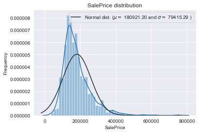


Let's plot Q-Q plot to compare the shapes of distributions, providing a graphical view of how properties such as location, scale, and skewness are similar or different in the two distributions. Q–Q plots can be used to compare collections of data, or theoretical distributions. 


```python
fig = plt.figure()
res = stats.probplot(train['SalePrice'], plot=plt)
```


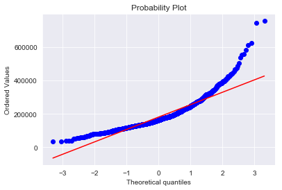


If one tail is longer than another, the distribution is skewed.
* A left-skewed distribution has a long left tail. Left-skewed distributions are also called negatively-skewed distributions. That’s because there is a long tail in the negative direction on the number line. The mean is also to the left of the peak.
* A right-skewed distribution has a long right tail. Right-skewed distributions are also called positive-skew distributions. That’s because there is a long tail in the positive direction on the number line. The mean is also to the right of the peak.

The target variable is right skewed. As (linear) models love normally distributed data , we need to transform this variable and make it more normally distributed.

The log transformation is the most popular among the different types of transformations used to transform skewed data to approximately conform to normality. If the original data follows a log-normal distribution or approximately so, then the log-transformed data follows a normal or near normal distribution.

Let's apply the numpy fuction log1p which use log(1+x) to all elements of the column


```python
train["SalePrice"] = np.log1p(train["SalePrice"])
```


```python
# Get the fitted parameters used by the function and plot the distribution 
(mu, sigma) = norm.fit(train['SalePrice'])
print( '\n mu = {:.2f} and sigma = {:.2f}\n'.format(mu, sigma))

plt.legend(['Normal dist. ($\mu=$ {:.2f} and $\sigma=$ {:.2f} )'.format(mu, sigma)], loc='best')
plt.ylabel('Frequency')
plt.title('SalePrice distribution')
sns.distplot(train['SalePrice'] , fit=norm)
```

    
     mu = 12.02 and sigma = 0.40
    


    <matplotlib.axes._subplots.AxesSubplot at 0x124252ef0>


Let's replot Q-Q plot to compare the shapes of distributions


```python
fig = plt.figure()
res = stats.probplot(train['SalePrice'], plot=plt)
```


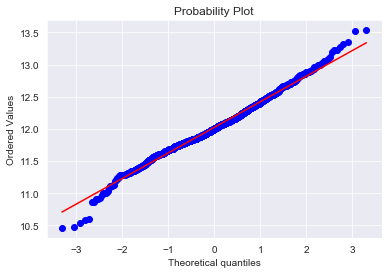


This is much better. 

***

### **Check the missing data**


```python
# check the missing value in training data
missing_train = train.isnull().sum().sort_values(ascending = False)
missing_train
```


    PoolQC           1453
    MiscFeature      1406
    Alley            1369
    Fence            1179
    FireplaceQu       690
    LotFrontage       259
    GarageCond         81
    GarageType         81
    GarageYrBlt        81
    GarageFinish       81
    GarageQual         81
    BsmtExposure       38
    BsmtFinType2       38
    BsmtFinType1       37
    BsmtCond           37
    BsmtQual           37
    MasVnrArea          8
    MasVnrType          8
    Electrical          1
    Utilities           0
    YearRemodAdd        0
    MSSubClass          0
    Foundation          0
    ExterCond           0
    ExterQual           0
    Exterior2nd         0
    Exterior1st         0
    RoofMatl            0
    RoofStyle           0
    YearBuilt           0
                     ... 
    GarageArea          0
    PavedDrive          0
    WoodDeckSF          0
    OpenPorchSF         0
    3SsnPorch           0
    BsmtUnfSF           0
    ScreenPorch         0
    PoolArea            0
    MiscVal             0
    MoSold              0
    YrSold              0
    SaleType            0
    Functional          0
    TotRmsAbvGrd        0
    KitchenQual         0
    KitchenAbvGr        0
    BedroomAbvGr        0
    HalfBath            0
    FullBath            0
    BsmtHalfBath        0
    BsmtFullBath        0
    GrLivArea           0
    LowQualFinSF        0
    2ndFlrSF            0
    1stFlrSF            0
    CentralAir          0
    SaleCondition       0
    Heating             0
    TotalBsmtSF         0
    Id                  0
    Length: 81, dtype: int64


```python
#plot the top 10 missing values
missing_x_axis = missing_train[:10]
missing_y_axis = missing_train[:10].index
width = 10
height = 8
plt.figure(figsize=(width, height))

sns.barplot(missing_x_axis, missing_y_axis)
plt.title('Missing value in trianing data')
```


    <matplotlib.text.Text at 0x1245ac240>


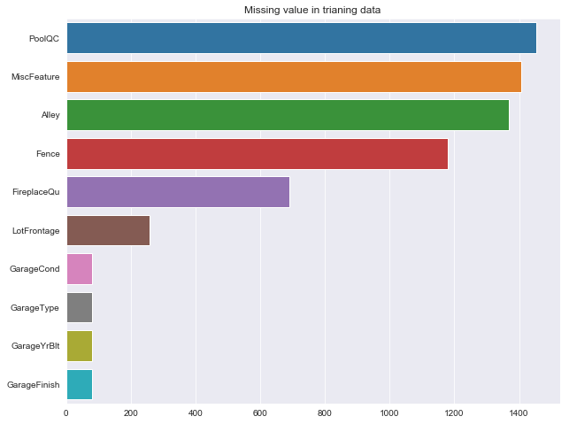


```python
# check the top 10 missing values in test data
missing_test = test.isnull().sum().sort_values(ascending = False)

missing_x_axis = missing_test[:10]
missing_y_axis = missing_test[:10].index

width = 10
height = 8
plt.figure(figsize=(width, height))

sns.barplot(missing_x_axis, missing_y_axis)
plt.title('Missing value in test data')
```


    <matplotlib.text.Text at 0x1241f78d0>


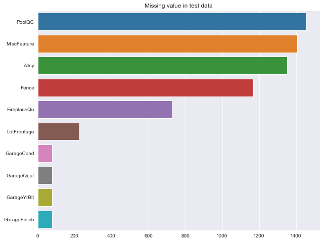


The plot above illustrate that there are plenty of variables are missing value. 

Before we proceed to deeper analysis, we need to have a look at these missing variables during the process of EDA. After that, I am going to apply feature engineering to deal with those missing value and make more correlated variables to make a accurate prediction model.

### **Filling the missing values**

For a few columns there is lots of NaN entries. However, reading the data description we find this is not missing data: For example, PoolQC, NaN is not missing data but means no pool, likewise for Fence, FireplaceQu etc.


```python
# columns where NaN values have meaning e.g. no pool etc.
cols_fillna = ['PoolQC','MiscFeature','Alley','Fence','MasVnrType','FireplaceQu',
               'GarageQual','GarageCond','GarageFinish','GarageType', 'Electrical',
               'KitchenQual', 'SaleType', 'Functional', 'Exterior2nd', 'Exterior1st',
               'BsmtExposure','BsmtCond','BsmtQual','BsmtFinType1','BsmtFinType2',
               'MSZoning', 'Utilities']

# replace 'NaN' with 'None' in these columns
for col in cols_fillna:
    train[col].fillna('None',inplace=True)
    test[col].fillna('None',inplace=True)
```


```python
missing_total = train.isnull().sum().sort_values(ascending=False)
missing_percent = (train.isnull().sum()/train.isnull().count()).sort_values(ascending=False)
missing_data = pd.concat([missing_total, missing_percent], axis=1, keys=['Missing Value Total', 'Percent'])
missing_data.head()
```


<div>
<style>
    .dataframe thead tr:only-child th {
        text-align: right;
    }

    .dataframe thead th {
        text-align: left;
    }

    .dataframe tbody tr th {
        vertical-align: top;
    }
</style>
<table border="1" class="dataframe">
  <thead>
    <tr style="text-align: right;">
      <th></th>
      <th>Missing Value Total</th>
      <th>Percent</th>
    </tr>
  </thead>
  <tbody>
    <tr>
      <th>LotFrontage</th>
      <td>259</td>
      <td>0.18</td>
    </tr>
    <tr>
      <th>GarageYrBlt</th>
      <td>81</td>
      <td>0.06</td>
    </tr>
    <tr>
      <th>MasVnrArea</th>
      <td>8</td>
      <td>0.01</td>
    </tr>
    <tr>
      <th>SalePrice</th>
      <td>0</td>
      <td>0.00</td>
    </tr>
    <tr>
      <th>ExterCond</th>
      <td>0</td>
      <td>0.00</td>
    </tr>
  </tbody>
</table>
</div>


```python
# fillna with mean for the remaining columns: LotFrontage, GarageYrBlt, MasVnrArea
cols_fillna = ['LotFrontage', 'GarageYrBlt', 'MasVnrArea']

for col in cols_fillna:
    train[col].fillna(train[col].mean(), inplace=True)
    test[col].fillna(test[col].mean(), inplace=True)
```


```python
missing_total = train.isnull().sum().sort_values(ascending=False)
missing_percent = (train.isnull().sum()/train.isnull().count()).sort_values(ascending=False)
missing_data = pd.concat([missing_total, missing_percent], axis=1, keys=['Missing Values Total', 'Percent'])
missing_data.head()
```


<div>
<style>
    .dataframe thead tr:only-child th {
        text-align: right;
    }

    .dataframe thead th {
        text-align: left;
    }

    .dataframe tbody tr th {
        vertical-align: top;
    }
</style>
<table border="1" class="dataframe">
  <thead>
    <tr style="text-align: right;">
      <th></th>
      <th>Missing Values Total</th>
      <th>Percent</th>
    </tr>
  </thead>
  <tbody>
    <tr>
      <th>SalePrice</th>
      <td>0</td>
      <td>0.00</td>
    </tr>
    <tr>
      <th>Heating</th>
      <td>0</td>
      <td>0.00</td>
    </tr>
    <tr>
      <th>RoofStyle</th>
      <td>0</td>
      <td>0.00</td>
    </tr>
    <tr>
      <th>RoofMatl</th>
      <td>0</td>
      <td>0.00</td>
    </tr>
    <tr>
      <th>Exterior1st</th>
      <td>0</td>
      <td>0.00</td>
    </tr>
  </tbody>
</table>
</div>


***

Like the target variable, some of the feature values are not normally distributed and it is therefore better to use log values in both training and test data. 

Initially let's divide the feature into numerical and categorical and find out some interesting details. 


```python
numerical_feats = train.dtypes[train.dtypes != "object"].index
print("Number of Numerical features: ", len(numerical_feats))

categorical_feats = train.dtypes[train.dtypes == "object"].index
print("Number of Categorical features: ", len(categorical_feats))
```

    Number of Numerical features:  38
    Number of Categorical features:  43


```python
print(train[numerical_feats].columns)
print("*"*100)
print(train[categorical_feats].columns)
```

    Index(['Id', 'MSSubClass', 'LotFrontage', 'LotArea', 'OverallQual',
           'OverallCond', 'YearBuilt', 'YearRemodAdd', 'MasVnrArea', 'BsmtFinSF1',
           'BsmtFinSF2', 'BsmtUnfSF', 'TotalBsmtSF', '1stFlrSF', '2ndFlrSF',
           'LowQualFinSF', 'GrLivArea', 'BsmtFullBath', 'BsmtHalfBath', 'FullBath',
           'HalfBath', 'BedroomAbvGr', 'KitchenAbvGr', 'TotRmsAbvGrd',
           'Fireplaces', 'GarageYrBlt', 'GarageCars', 'GarageArea', 'WoodDeckSF',
           'OpenPorchSF', 'EnclosedPorch', '3SsnPorch', 'ScreenPorch', 'PoolArea',
           'MiscVal', 'MoSold', 'YrSold', 'SalePrice'],
          dtype='object')
    ****************************************************************************************************
    Index(['MSZoning', 'Street', 'Alley', 'LotShape', 'LandContour', 'Utilities',
           'LotConfig', 'LandSlope', 'Neighborhood', 'Condition1', 'Condition2',
           'BldgType', 'HouseStyle', 'RoofStyle', 'RoofMatl', 'Exterior1st',
           'Exterior2nd', 'MasVnrType', 'ExterQual', 'ExterCond', 'Foundation',
           'BsmtQual', 'BsmtCond', 'BsmtExposure', 'BsmtFinType1', 'BsmtFinType2',
           'Heating', 'HeatingQC', 'CentralAir', 'Electrical', 'KitchenQual',
           'Functional', 'FireplaceQu', 'GarageType', 'GarageFinish', 'GarageQual',
           'GarageCond', 'PavedDrive', 'PoolQC', 'Fence', 'MiscFeature',
           'SaleType', 'SaleCondition'],
          dtype='object')


### skewness and kurtosis
Let's check for skewness and kurtosis in numerical features


```python
for col in numerical_feats:
    print('{:15}'.format(col), 
          'Skewness: {:05.2f}'.format(train[col].skew()) , 
          '   ' ,
          'Kurtosis: {:06.2f}'.format(train[col].kurt())  
         )
```

    Id              Skewness: 00.00     Kurtosis: -01.20
    MSSubClass      Skewness: 01.41     Kurtosis: 001.58
    LotFrontage     Skewness: 02.38     Kurtosis: 021.85
    LotArea         Skewness: 12.21     Kurtosis: 203.24
    OverallQual     Skewness: 00.22     Kurtosis: 000.10
    OverallCond     Skewness: 00.69     Kurtosis: 001.11
    YearBuilt       Skewness: -0.61     Kurtosis: -00.44
    YearRemodAdd    Skewness: -0.50     Kurtosis: -01.27
    MasVnrArea      Skewness: 02.68     Kurtosis: 010.15
    BsmtFinSF1      Skewness: 01.69     Kurtosis: 011.12
    BsmtFinSF2      Skewness: 04.26     Kurtosis: 020.11
    BsmtUnfSF       Skewness: 00.92     Kurtosis: 000.47
    TotalBsmtSF     Skewness: 01.52     Kurtosis: 013.25
    1stFlrSF        Skewness: 01.38     Kurtosis: 005.75
    2ndFlrSF        Skewness: 00.81     Kurtosis: -00.55
    LowQualFinSF    Skewness: 09.01     Kurtosis: 083.23
    GrLivArea       Skewness: 01.37     Kurtosis: 004.90
    BsmtFullBath    Skewness: 00.60     Kurtosis: -00.84
    BsmtHalfBath    Skewness: 04.10     Kurtosis: 016.40
    FullBath        Skewness: 00.04     Kurtosis: -00.86
    HalfBath        Skewness: 00.68     Kurtosis: -01.08
    BedroomAbvGr    Skewness: 00.21     Kurtosis: 002.23
    KitchenAbvGr    Skewness: 04.49     Kurtosis: 021.53
    TotRmsAbvGrd    Skewness: 00.68     Kurtosis: 000.88
    Fireplaces      Skewness: 00.65     Kurtosis: -00.22
    GarageYrBlt     Skewness: -0.67     Kurtosis: -00.27
    GarageCars      Skewness: -0.34     Kurtosis: 000.22
    GarageArea      Skewness: 00.18     Kurtosis: 000.92
    WoodDeckSF      Skewness: 01.54     Kurtosis: 002.99
    OpenPorchSF     Skewness: 02.36     Kurtosis: 008.49
    EnclosedPorch   Skewness: 03.09     Kurtosis: 010.43
    3SsnPorch       Skewness: 10.30     Kurtosis: 123.66
    ScreenPorch     Skewness: 04.12     Kurtosis: 018.44
    PoolArea        Skewness: 14.83     Kurtosis: 223.27
    MiscVal         Skewness: 24.48     Kurtosis: 701.00
    MoSold          Skewness: 00.21     Kurtosis: -00.40
    YrSold          Skewness: 00.10     Kurtosis: -01.19
    SalePrice       Skewness: 00.12     Kurtosis: 000.81


```python
skewed_features = ['LotFrontage', 'LotArea', 'MasVnrArea', 'BsmtFinSF2', 'LowQualFinSF', 'GrLivArea'
                   , 'BsmtHalfBath', 'BsmtFinSF1', 'TotalBsmtSF', 'WoodDeckSF', 'OpenPorchSF'
                   , 'KitchenAbvGr', 'EnclosedPorch', '3SsnPorch', 'ScreenPorch', 'PoolArea', 'MiscVal']
```


```python
for feature in skewed_features:
    train[feature] = np.log1p(train[feature])
    test[feature] = np.log1p(test[feature])
```


```python
len(numerical_feats)
```


    38


```python
nr_rows = 12
nr_cols = 3

fig, axs = plt.subplots(nr_rows, nr_cols, figsize=(nr_cols*3.5,nr_rows*3))

li_num_feats = list(numerical_feats)
li_not_plot = ['Id', 'SalePrice']
li_plot_num_feats = [c for c in list(numerical_feats) if c not in li_not_plot]


for r in range(0,nr_rows):
    for c in range(0,nr_cols):  
        i = r*nr_cols+c
        if i < len(li_plot_num_feats):
            sns.regplot(train[li_plot_num_feats[i]], train['SalePrice'], ax = axs[r][c])
            stp = stats.pearsonr(train[li_plot_num_feats[i]], train['SalePrice'])
            #axs[r][c].text(0.4,0.9,"title",fontsize=7)
            str_title = "r = " + "{0:.2f}".format(stp[0]) + "      " "p = " + "{0:.2f}".format(stp[1])
            axs[r][c].set_title(str_title,fontsize=11)
            
plt.tight_layout()    
plt.show()   
```


### Summary on numerical features:

* some of the features like "OverallQual" have strong linear correlation 82% towards the target. 
* while some of other features like "MSSubClass" have a quite weak correlation to the taget variable. 
* there are several features in the numerical way turns out to be the categorical based on the plots (like "OverallQual"). 

### Remove the outliers


```python
train = train.drop(
    train[(train['OverallQual']==10) & (train['SalePrice']<12.3)].index)
train = train.drop(
    train[(train['GrLivArea']>8.3) & (train['SalePrice']<12.5)].index)
```

Find out the features which have a strong correlation to the target variable. 


```python
corr = train.corr()
corr_abs = corr.abs()
min_val_corr = 0.4    


nr_num_cols = len(numerical_feats)
ser_corr = corr_abs.nlargest(nr_num_cols, 'SalePrice')['SalePrice']

cols_abv_corr_limit = list(ser_corr[ser_corr.values > min_val_corr].index)
cols_bel_corr_limit = list(ser_corr[ser_corr.values <= min_val_corr].index)
```

List the features and their correlation coeffient to the target variable.


```python
print(ser_corr)
```

    SalePrice       1.00
    OverallQual     0.82
    GrLivArea       0.74
    GarageCars      0.68
    GarageArea      0.66
    1stFlrSF        0.62
    FullBath        0.60
    YearBuilt       0.59
    YearRemodAdd    0.57
    TotRmsAbvGrd    0.54
    GarageYrBlt     0.50
    Fireplaces      0.49
    OpenPorchSF     0.46
    MasVnrArea      0.42
    LotArea         0.40
    TotalBsmtSF     0.37
    LotFrontage     0.35
    WoodDeckSF      0.34
    2ndFlrSF        0.32
    HalfBath        0.31
    BsmtFullBath    0.24
    BsmtUnfSF       0.22
    BedroomAbvGr    0.21
    BsmtFinSF1      0.21
    EnclosedPorch   0.21
    KitchenAbvGr    0.14
    ScreenPorch     0.11
    PoolArea        0.08
    MSSubClass      0.07
    MiscVal         0.07
    3SsnPorch       0.06
    MoSold          0.06
    LowQualFinSF    0.05
    YrSold          0.04
    OverallCond     0.04
    BsmtFinSF2      0.03
    Id              0.02
    BsmtHalfBath    0.00
    Name: SalePrice, dtype: float64


```python
print("List of numerical features with r above min_val_corr :", cols_abv_corr_limit)
```

    List of numerical features with r above min_val_corr : ['SalePrice', 'OverallQual', 'GrLivArea', 'GarageCars', 'GarageArea', '1stFlrSF', 'FullBath', 'YearBuilt', 'YearRemodAdd', 'TotRmsAbvGrd', 'GarageYrBlt', 'Fireplaces', 'OpenPorchSF', 'MasVnrArea', 'LotArea']


```python
print("List of numerical features with r below min_val_corr :", cols_bel_corr_limit)
```

    List of numerical features with r below min_val_corr : ['TotalBsmtSF', 'LotFrontage', 'WoodDeckSF', '2ndFlrSF', 'HalfBath', 'BsmtFullBath', 'BsmtUnfSF', 'BedroomAbvGr', 'BsmtFinSF1', 'EnclosedPorch', 'KitchenAbvGr', 'ScreenPorch', 'PoolArea', 'MSSubClass', 'MiscVal', '3SsnPorch', 'MoSold', 'LowQualFinSF', 'YrSold', 'OverallCond', 'BsmtFinSF2', 'Id', 'BsmtHalfBath']


***

### Let's turn to the categoical features.

The unique value in these categorical features.


```python
for catg in list(categorical_feats) :
    print(train[catg].value_counts())
    print('*'*50)
```

    RL         1149
    RM          218
    FV           65
    RH           16
    C (all)      10
    Name: MSZoning, dtype: int64
    **************************************************
    Pave    1452
    Grvl       6
    Name: Street, dtype: int64
    **************************************************
    None    1367
    Grvl      50
    Pave      41
    Name: Alley, dtype: int64
    **************************************************
    Reg    925
    IR1    483
    IR2     41
    IR3      9
    Name: LotShape, dtype: int64
    **************************************************
    Lvl    1311
    Bnk      61
    HLS      50
    Low      36
    Name: LandContour, dtype: int64
    **************************************************
    AllPub    1457
    NoSeWa       1
    Name: Utilities, dtype: int64
    **************************************************
    Inside     1051
    Corner      262
    CulDSac      94
    FR2          47
    FR3           4
    Name: LotConfig, dtype: int64
    **************************************************
    Gtl    1380
    Mod      65
    Sev      13
    Name: LandSlope, dtype: int64
    **************************************************
    NAmes      225
    CollgCr    150
    OldTown    113
    Edwards     98
    Somerst     86
    Gilbert     79
    NridgHt     77
    Sawyer      74
    NWAmes      73
    SawyerW     59
    BrkSide     58
    Crawfor     51
    Mitchel     49
    NoRidge     41
    Timber      38
    IDOTRR      37
    ClearCr     28
    SWISU       25
    StoneBr     25
    MeadowV     17
    Blmngtn     17
    BrDale      16
    Veenker     11
    NPkVill      9
    Blueste      2
    Name: Neighborhood, dtype: int64
    **************************************************
    Norm      1260
    Feedr       80
    Artery      48
    RRAn        26
    PosN        18
    RRAe        11
    PosA         8
    RRNn         5
    RRNe         2
    Name: Condition1, dtype: int64
    **************************************************
    Norm      1444
    Feedr        6
    Artery       2
    RRNn         2
    RRAe         1
    RRAn         1
    PosA         1
    PosN         1
    Name: Condition2, dtype: int64
    **************************************************
    1Fam      1218
    TwnhsE     114
    Duplex      52
    Twnhs       43
    2fmCon      31
    Name: BldgType, dtype: int64
    **************************************************
    1Story    726
    2Story    443
    1.5Fin    154
    SLvl       65
    SFoyer     37
    1.5Unf     14
    2.5Unf     11
    2.5Fin      8
    Name: HouseStyle, dtype: int64
    **************************************************
    Gable      1141
    Hip         284
    Flat         13
    Gambrel      11
    Mansard       7
    Shed          2
    Name: RoofStyle, dtype: int64
    **************************************************
    CompShg    1433
    Tar&Grv      11
    WdShngl       6
    WdShake       5
    Membran       1
    Roll          1
    Metal         1
    Name: RoofMatl, dtype: int64
    **************************************************
    VinylSd    515
    HdBoard    222
    MetalSd    220
    Wd Sdng    206
    Plywood    108
    CemntBd     60
    BrkFace     50
    WdShing     26
    Stucco      24
    AsbShng     20
    BrkComm      2
    Stone        2
    AsphShn      1
    ImStucc      1
    CBlock       1
    Name: Exterior1st, dtype: int64
    **************************************************
    VinylSd    504
    MetalSd    214
    HdBoard    207
    Wd Sdng    197
    Plywood    142
    CmentBd     59
    Wd Shng     38
    BrkFace     25
    Stucco      25
    AsbShng     20
    ImStucc     10
    Brk Cmn      7
    Stone        5
    AsphShn      3
    Other        1
    CBlock       1
    Name: Exterior2nd, dtype: int64
    **************************************************
    None       872
    BrkFace    445
    Stone      126
    BrkCmn      15
    Name: MasVnrType, dtype: int64
    **************************************************
    TA    906
    Gd    488
    Ex     50
    Fa     14
    Name: ExterQual, dtype: int64
    **************************************************
    TA    1280
    Gd     146
    Fa      28
    Ex       3
    Po       1
    Name: ExterCond, dtype: int64
    **************************************************
    PConc     645
    CBlock    634
    BrkTil    146
    Slab       24
    Stone       6
    Wood        3
    Name: Foundation, dtype: int64
    **************************************************
    TA      649
    Gd      618
    Ex      119
    None     37
    Fa       35
    Name: BsmtQual, dtype: int64
    **************************************************
    TA      1309
    Gd        65
    Fa        45
    None      37
    Po         2
    Name: BsmtCond, dtype: int64
    **************************************************
    No      953
    Av      221
    Gd      132
    Mn      114
    None     38
    Name: BsmtExposure, dtype: int64
    **************************************************
    Unf     430
    GLQ     416
    ALQ     220
    BLQ     148
    Rec     133
    LwQ      74
    None     37
    Name: BsmtFinType1, dtype: int64
    **************************************************
    Unf     1254
    Rec       54
    LwQ       46
    None      38
    BLQ       33
    ALQ       19
    GLQ       14
    Name: BsmtFinType2, dtype: int64
    **************************************************
    GasA     1426
    GasW       18
    Grav        7
    Wall        4
    OthW        2
    Floor       1
    Name: Heating, dtype: int64
    **************************************************
    Ex    739
    TA    428
    Gd    241
    Fa     49
    Po      1
    Name: HeatingQC, dtype: int64
    **************************************************
    Y    1363
    N      95
    Name: CentralAir, dtype: int64
    **************************************************
    SBrkr    1332
    FuseA      94
    FuseF      27
    FuseP       3
    None        1
    Mix         1
    Name: Electrical, dtype: int64
    **************************************************
    TA    735
    Gd    586
    Ex     98
    Fa     39
    Name: KitchenQual, dtype: int64
    **************************************************
    Typ     1358
    Min2      34
    Min1      31
    Mod       15
    Maj1      14
    Maj2       5
    Sev        1
    Name: Functional, dtype: int64
    **************************************************
    None    690
    Gd      378
    TA      313
    Fa       33
    Ex       24
    Po       20
    Name: FireplaceQu, dtype: int64
    **************************************************
    Attchd     869
    Detchd     387
    BuiltIn     87
    None        81
    Basment     19
    CarPort      9
    2Types       6
    Name: GarageType, dtype: int64
    **************************************************
    Unf     605
    RFn     422
    Fin     350
    None     81
    Name: GarageFinish, dtype: int64
    **************************************************
    TA      1309
    None      81
    Fa        48
    Gd        14
    Po         3
    Ex         3
    Name: GarageQual, dtype: int64
    **************************************************
    TA      1324
    None      81
    Fa        35
    Gd         9
    Po         7
    Ex         2
    Name: GarageCond, dtype: int64
    **************************************************
    Y    1338
    N      90
    P      30
    Name: PavedDrive, dtype: int64
    **************************************************
    None    1452
    Ex         2
    Fa         2
    Gd         2
    Name: PoolQC, dtype: int64
    **************************************************
    None     1177
    MnPrv     157
    GdPrv      59
    GdWo       54
    MnWw       11
    Name: Fence, dtype: int64
    **************************************************
    None    1404
    Shed      49
    Gar2       2
    Othr       2
    TenC       1
    Name: MiscFeature, dtype: int64
    **************************************************
    WD       1267
    New       120
    COD        43
    ConLD       9
    ConLI       5
    ConLw       5
    CWD         4
    Oth         3
    Con         2
    Name: SaleType, dtype: int64
    **************************************************
    Normal     1198
    Partial     123
    Abnorml     101
    Family       20
    Alloca       12
    AdjLand       4
    Name: SaleCondition, dtype: int64
    **************************************************


Their correlations to the target variable.


```python
nr_rows = 15
nr_cols = 3

fig, axs = plt.subplots(nr_rows, nr_cols, figsize=(nr_cols*4,nr_rows*3))

for r in range(0,nr_rows):
    for c in range(0,nr_cols):  
        i = r*nr_cols+c
        if i < len(list(categorical_feats)):
            sns.boxplot(x=list(categorical_feats)[i], y='SalePrice', data=train, ax = axs[r][c])
    
plt.tight_layout()    
plt.show()   
```


```python
catg_strong_corr = [ 'MSZoning', 'Neighborhood', 'Condition2', 'MasVnrType', 'ExterQual', 
                     'BsmtQual','CentralAir', 'Electrical', 'KitchenQual', 'SaleType']

catg_weak_corr = ['Street', 'Alley', 'LotShape', 'LandContour', 'Utilities', 'LotConfig', 
                  'LandSlope', 'Condition1',  'BldgType', 'HouseStyle', 'RoofStyle', 
                  'RoofMatl', 'Exterior1st', 'Exterior2nd', 'ExterCond', 'Foundation', 
                  'BsmtCond', 'BsmtExposure', 'BsmtFinType1', 'BsmtFinType2', 'Heating', 
                  'HeatingQC', 'Functional', 'FireplaceQu', 'GarageType', 'GarageFinish', 
                  'GarageQual', 'GarageCond', 'PavedDrive', 'PoolQC', 'Fence', 'MiscFeature', 
                  'SaleCondition']
```

### Confusion Matrix


```python
def plot_corr_matrix(df, nr_c, targ) :
    
    corr = df.corr()
    corr_abs = corr.abs()
    cols = corr_abs.nlargest(nr_c, targ)[targ].index
    cm = np.corrcoef(df[cols].values.T)

    plt.figure(figsize=(nr_c/1.5, nr_c/1.5))
    sns.set(font_scale=1.25)
    sns.heatmap(cm, linewidths=1.5, annot=True, square=True, 
                fmt='.2f', annot_kws={'size': 10}, 
                yticklabels=cols.values, xticklabels=cols.values
               )
    plt.show()
```


```python
nr_feats = len(cols_abv_corr_limit)
```


```python
plot_corr_matrix(train, nr_feats, 'SalePrice')
```


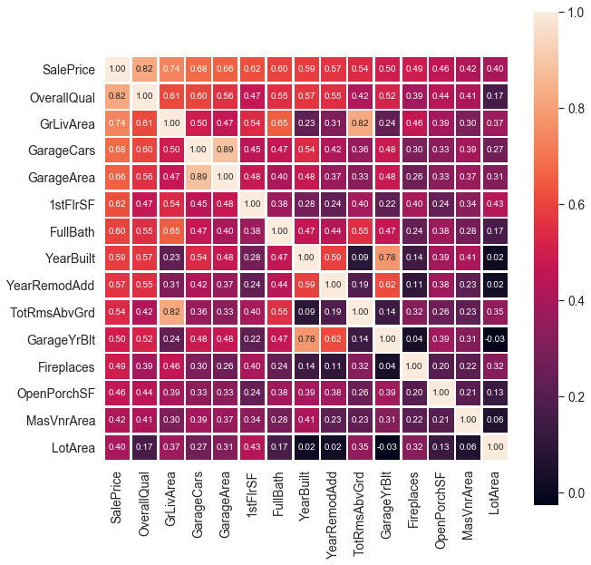


***

### Data Wrangling 

In this section, the priority is to drop the less correlated features to the target variable in the dataset. Plus, transform some of the catregorical features to the numerical ones.

In a nutshell: 

* for numerical features: drop the similar and less correlated features
* for categorical features: transform them to numerical


```python
id_test = test['Id']

to_drop_num  = cols_bel_corr_limit
to_drop_catg = catg_weak_corr

cols_to_drop = ['Id'] + to_drop_num + to_drop_catg 

for df in [train, test]:
    df.drop(cols_to_drop, inplace= True, axis = 1)
```


```python
catg_list = catg_strong_corr.copy()
catg_list.remove('Neighborhood')

for catg in catg_list :
    sns.boxenplot(x=catg, y='SalePrice', data=train)
    plt.show()
```


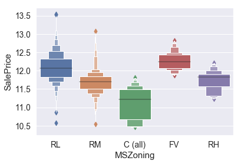


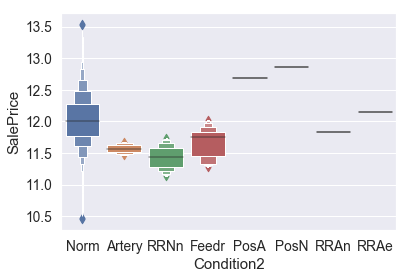


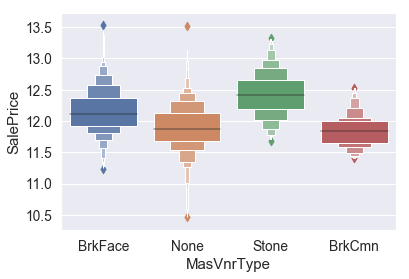


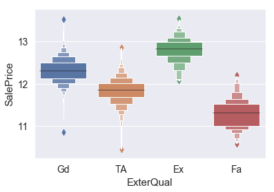


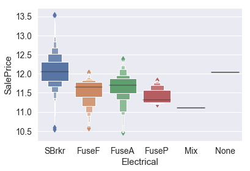


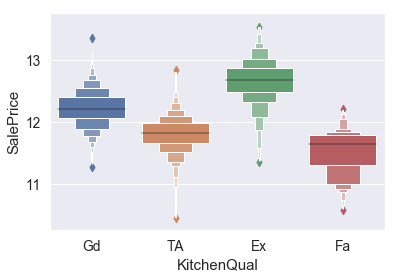


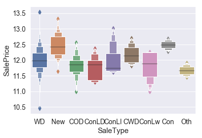


```python
fig, ax = plt.subplots()
fig.set_size_inches(16, 5)
sns.boxenplot(x='Neighborhood', y='SalePrice', data=train, ax=ax)
plt.xticks(rotation=45)
plt.show()
```


```python
for catg in catg_list :
    group = train.groupby(catg)['SalePrice'].mean()
    print(group)
```

    MSZoning
    C (all)   11.12
    FV        12.25
    RH        11.75
    RL        12.09
    RM        11.69
    Name: SalePrice, dtype: float64
    Condition2
    Artery   11.57
    Feedr    11.67
    Norm     12.03
    PosA     12.69
    PosN     12.86
    RRAe     12.15
    RRAn     11.83
    RRNn     11.44
    Name: SalePrice, dtype: float64
    MasVnrType
    BrkCmn    11.85
    BrkFace   12.16
    None      11.90
    Stone     12.43
    Name: SalePrice, dtype: float64
    ExterQual
    Ex   12.79
    Fa   11.30
    Gd   12.31
    TA   11.84
    Name: SalePrice, dtype: float64
    BsmtQual
    Ex     12.65
    Fa     11.62
    Gd     12.18
    None   11.53
    TA     11.81
    Name: SalePrice, dtype: float64
    CentralAir
    N   11.49
    Y   12.06
    Name: SalePrice, dtype: float64
    Electrical
    FuseA   11.66
    FuseF   11.54
    FuseP   11.45
    Mix     11.11
    None    12.03
    SBrkr   12.06
    Name: SalePrice, dtype: float64
    KitchenQual
    Ex   12.65
    Fa   11.50
    Gd   12.22
    TA   11.81
    Name: SalePrice, dtype: float64
    SaleType
    COD     11.83
    CWD     12.20
    Con     12.48
    ConLD   11.77
    ConLI   12.04
    ConLw   11.77
    New     12.47
    Oth     11.68
    WD      11.99
    Name: SalePrice, dtype: float64


```python
# 'MSZoning'
msz_catg2 = ['RM', 'RH']
msz_catg3 = ['RL', 'FV'] 


# Neighborhood
nbhd_catg2 = ['Blmngtn', 'ClearCr', 'CollgCr', 'Crawfor', 'Gilbert', 'NWAmes', 'Somerst', 'Timber', 'Veenker']
nbhd_catg3 = ['NoRidge', 'NridgHt', 'StoneBr']

# Condition2
cond2_catg2 = ['Norm', 'RRAe']
cond2_catg3 = ['PosA', 'PosN'] 

# SaleType
SlTy_catg1 = ['Oth']
SlTy_catg3 = ['CWD']
SlTy_catg4 = ['New', 'Con']
```


```python
for df in [train, test]:
    
    df['MSZ_num'] = 1  
    df.loc[(df['MSZoning'].isin(msz_catg2) ), 'MSZ_num'] = 2    
    df.loc[(df['MSZoning'].isin(msz_catg3) ), 'MSZ_num'] = 3        
    
    df['NbHd_num'] = 1       
    df.loc[(df['Neighborhood'].isin(nbhd_catg2) ), 'NbHd_num'] = 2    
    df.loc[(df['Neighborhood'].isin(nbhd_catg3) ), 'NbHd_num'] = 3    

    df['Cond2_num'] = 1       
    df.loc[(df['Condition2'].isin(cond2_catg2) ), 'Cond2_num'] = 2    
    df.loc[(df['Condition2'].isin(cond2_catg3) ), 'Cond2_num'] = 3    
    
    df['Mas_num'] = 1       
    df.loc[(df['MasVnrType'] == 'Stone' ), 'Mas_num'] = 2 
    
    df['ExtQ_num'] = 1       
    df.loc[(df['ExterQual'] == 'TA' ), 'ExtQ_num'] = 2     
    df.loc[(df['ExterQual'] == 'Gd' ), 'ExtQ_num'] = 3     
    df.loc[(df['ExterQual'] == 'Ex' ), 'ExtQ_num'] = 4     
   
    df['BsQ_num'] = 1          
    df.loc[(df['BsmtQual'] == 'Gd' ), 'BsQ_num'] = 2     
    df.loc[(df['BsmtQual'] == 'Ex' ), 'BsQ_num'] = 3     
    
    df['CA_num'] = 0          
    df.loc[(df['CentralAir'] == 'Y' ), 'CA_num'] = 1    

    df['Elc_num'] = 1       
    df.loc[(df['Electrical'] == 'SBrkr' ), 'Elc_num'] = 2 


    df['KiQ_num'] = 1       
    df.loc[(df['KitchenQual'] == 'TA' ), 'KiQ_num'] = 2     
    df.loc[(df['KitchenQual'] == 'Gd' ), 'KiQ_num'] = 3     
    df.loc[(df['KitchenQual'] == 'Ex' ), 'KiQ_num'] = 4      
    
    df['SlTy_num'] = 2       
    df.loc[(df['SaleType'].isin(SlTy_catg1) ), 'SlTy_num'] = 1  
    df.loc[(df['SaleType'].isin(SlTy_catg3) ), 'SlTy_num'] = 3  
    df.loc[(df['SaleType'].isin(SlTy_catg4) ), 'SlTy_num'] = 4  
```


```python
new_col_num = ['MSZ_num', 'NbHd_num', 'Cond2_num'
               , 'Mas_num', 'ExtQ_num', 'BsQ_num'
               , 'CA_num', 'Elc_num', 'KiQ_num', 'SlTy_num']
```


```python
nr_rows = 4
nr_cols = 3

fig, axs = plt.subplots(nr_rows, nr_cols, figsize=(nr_cols*3.5,nr_rows*3))

for r in range(0,nr_rows):
    for c in range(0,nr_cols):  
        i = r*nr_cols+c
        if i < len(new_col_num):
            sns.regplot(train[new_col_num[i]], train['SalePrice'], ax = axs[r][c])
            stp = stats.pearsonr(train[new_col_num[i]], train['SalePrice'])
            str_title = "r = " + "{0:.2f}".format(stp[0]) + "      " "p = " + "{0:.2f}".format(stp[1])
            axs[r][c].set_title(str_title,fontsize=11)
            
plt.tight_layout()    
```


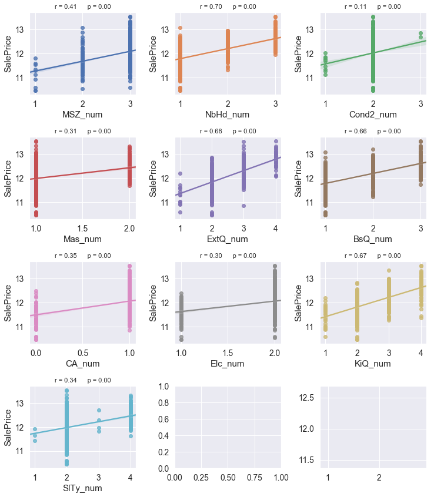


In these plots, we can see there are several features like "NbHd_num, ExtQ_num, BsQ_num, KiQ_num" have a strong correlation to the target variable.


```python
catg_cols_to_drop = ['Neighborhood' , 'Condition2', 'MasVnrType'
                     , 'ExterQual', 'BsmtQual','CentralAir', 'Electrical'
                     , 'KitchenQual', 'SaleType']
```


```python
corr1 = train.corr()
corr_abs_1 = corr1.abs()

nr_all_cols = len(train)
ser_corr_1 = corr_abs_1.nlargest(nr_all_cols, 'SalePrice')['SalePrice']

print(ser_corr_1)
```

    SalePrice      1.00
    OverallQual    0.82
    GrLivArea      0.74
    NbHd_num       0.70
    ExtQ_num       0.68
    GarageCars     0.68
    KiQ_num        0.67
    BsQ_num        0.66
    GarageArea     0.66
    1stFlrSF       0.62
    FullBath       0.60
    YearBuilt      0.59
    YearRemodAdd   0.57
    TotRmsAbvGrd   0.54
    GarageYrBlt    0.50
    Fireplaces     0.49
    OpenPorchSF    0.46
    MasVnrArea     0.42
    MSZ_num        0.41
    LotArea        0.40
    CA_num         0.35
    SlTy_num       0.34
    Mas_num        0.31
    Elc_num        0.30
    Cond2_num      0.11
    Name: SalePrice, dtype: float64


```python
cols_bel_corr_limit_1 = list(ser_corr_1[ser_corr_1.values <= min_val_corr].index)
for df in [train, test] :
    df.drop(catg_cols_to_drop, inplace= True, axis = 1)
    df.drop(cols_bel_corr_limit_1, inplace= True, axis = 1)    
```

Finally, let's list of all features with strong correlation to target variable.


```python
corr = train.corr()
corr_abs = corr.abs()

nr_all_cols = len(train)
print (corr_abs.nlargest(nr_all_cols, 'SalePrice')['SalePrice'])
```

    SalePrice      1.00
    OverallQual    0.82
    GrLivArea      0.74
    NbHd_num       0.70
    ExtQ_num       0.68
    GarageCars     0.68
    KiQ_num        0.67
    BsQ_num        0.66
    GarageArea     0.66
    1stFlrSF       0.62
    FullBath       0.60
    YearBuilt      0.59
    YearRemodAdd   0.57
    TotRmsAbvGrd   0.54
    GarageYrBlt    0.50
    Fireplaces     0.49
    OpenPorchSF    0.46
    MasVnrArea     0.42
    MSZ_num        0.41
    LotArea        0.40
    Name: SalePrice, dtype: float64


```python
nr_feats=len(train.columns)
plot_corr_matrix(train, nr_feats, 'SalePrice')
```


### Multicollinearity

Multicollinearity (or inter correlation) exists when at least some of the predictor variables are correlated among themselves.

Strong correlation of these features to other, similar features:

* 'GrLivArea_Log' and 'TotRmsAbvGrd'

* 'GarageCars' and 'GarageArea'

* 'TotalBsmtSF' and '1stFlrSF'

* 'YearBuilt' and 'GarageYrBlt'

Of those features we drop the one  with a less correlated coeffiecient to target variable.


```python
# switch for dropping columns that are similar to others already used and show a high correlation to these     
drop_similar = 1
```


```python
cols = corr_abs.nlargest(nr_all_cols, 'SalePrice')['SalePrice'].index
cols = list(cols)

if drop_similar == 1 :
    for col in ['GarageArea','1stFlrSF','TotRmsAbvGrd','GarageYrBlt'] :
        if col in cols: 
            cols.remove(col)
```


```python
print(list(cols))
```

    ['SalePrice', 'OverallQual', 'GrLivArea', 'NbHd_num', 'ExtQ_num', 'GarageCars', 'KiQ_num', 'BsQ_num', 'FullBath', 'YearBuilt', 'YearRemodAdd', 'Fireplaces', 'OpenPorchSF', 'MasVnrArea', 'MSZ_num', 'LotArea']


Get the list of the features/columns for the following modelling


```python
feats = cols.copy()
feats.remove('SalePrice')

print(feats)
```

    ['OverallQual', 'GrLivArea', 'NbHd_num', 'ExtQ_num', 'GarageCars', 'KiQ_num', 'BsQ_num', 'FullBath', 'YearBuilt', 'YearRemodAdd', 'Fireplaces', 'OpenPorchSF', 'MasVnrArea', 'MSZ_num', 'LotArea']


```python
df_train_ml = train[feats].copy()
df_test_ml  = test[feats].copy()

y = train['SalePrice']
```


```python
all_data = pd.concat((train[feats], test[feats]))
```


```python
df_train_ml = all_data[:train.shape[0]]
df_test_ml  = all_data[train.shape[0]:]
```

### StandardScaler 

Standardize features by removing the mean and scaling to unit variance


```python
from sklearn.preprocessing import StandardScaler
```


```python
sc = StandardScaler()
df_train_ml_sc = sc.fit_transform(df_train_ml)
df_test_ml_sc = sc.transform(df_test_ml)
```


```python
df_train_ml_sc = pd.DataFrame(df_train_ml_sc)
df_test_ml_sc = pd.DataFrame(df_test_ml_sc)
```

### Creating the new dataset for the further modelling


```python
X = df_train_ml.copy()
y = train['SalePrice']
X_test = df_test_ml.copy()

X_sc = df_train_ml_sc.copy()
y_sc = train['SalePrice']
X_test_sc = df_test_ml_sc.copy()
```


```python
X.info()
```

    <class 'pandas.core.frame.DataFrame'>
    Int64Index: 1458 entries, 0 to 1459
    Data columns (total 40 columns):
    GrLivArea         1458 non-null float64
    YearBuilt         1458 non-null int64
    YearRemodAdd      1458 non-null int64
    OpenPorchSF       1458 non-null float64
    MasVnrArea        1458 non-null float64
    LotArea           1458 non-null float64
    OverallQual_2     1458 non-null uint8
    OverallQual_3     1458 non-null uint8
    OverallQual_4     1458 non-null uint8
    OverallQual_5     1458 non-null uint8
    OverallQual_6     1458 non-null uint8
    OverallQual_7     1458 non-null uint8
    OverallQual_8     1458 non-null uint8
    OverallQual_9     1458 non-null uint8
    OverallQual_10    1458 non-null uint8
    NbHd_num_2        1458 non-null uint8
    NbHd_num_3        1458 non-null uint8
    GarageCars_1.0    1458 non-null uint8
    GarageCars_2.0    1458 non-null uint8
    GarageCars_3.0    1458 non-null uint8
    GarageCars_4.0    1458 non-null uint8
    GarageCars_5.0    1458 non-null uint8
    ExtQ_num_2        1458 non-null uint8
    ExtQ_num_3        1458 non-null uint8
    ExtQ_num_4        1458 non-null uint8
    KiQ_num_2         1458 non-null uint8
    KiQ_num_3         1458 non-null uint8
    KiQ_num_4         1458 non-null uint8
    BsQ_num_2         1458 non-null uint8
    BsQ_num_3         1458 non-null uint8
    FullBath_1        1458 non-null uint8
    FullBath_2        1458 non-null uint8
    FullBath_3        1458 non-null uint8
    FullBath_4        1458 non-null uint8
    Fireplaces_1      1458 non-null uint8
    Fireplaces_2      1458 non-null uint8
    Fireplaces_3      1458 non-null uint8
    Fireplaces_4      1458 non-null uint8
    MSZ_num_2         1458 non-null uint8
    MSZ_num_3         1458 non-null uint8
    dtypes: float64(4), int64(2), uint8(34)
    memory usage: 128.1 KB


```python
X_test.info()
```

    <class 'pandas.core.frame.DataFrame'>
    Int64Index: 1459 entries, 0 to 1458
    Data columns (total 40 columns):
    GrLivArea         1459 non-null float64
    YearBuilt         1459 non-null int64
    YearRemodAdd      1459 non-null int64
    OpenPorchSF       1459 non-null float64
    MasVnrArea        1459 non-null float64
    LotArea           1459 non-null float64
    OverallQual_2     1459 non-null uint8
    OverallQual_3     1459 non-null uint8
    OverallQual_4     1459 non-null uint8
    OverallQual_5     1459 non-null uint8
    OverallQual_6     1459 non-null uint8
    OverallQual_7     1459 non-null uint8
    OverallQual_8     1459 non-null uint8
    OverallQual_9     1459 non-null uint8
    OverallQual_10    1459 non-null uint8
    NbHd_num_2        1459 non-null uint8
    NbHd_num_3        1459 non-null uint8
    GarageCars_1.0    1459 non-null uint8
    GarageCars_2.0    1459 non-null uint8
    GarageCars_3.0    1459 non-null uint8
    GarageCars_4.0    1459 non-null uint8
    GarageCars_5.0    1459 non-null uint8
    ExtQ_num_2        1459 non-null uint8
    ExtQ_num_3        1459 non-null uint8
    ExtQ_num_4        1459 non-null uint8
    KiQ_num_2         1459 non-null uint8
    KiQ_num_3         1459 non-null uint8
    KiQ_num_4         1459 non-null uint8
    BsQ_num_2         1459 non-null uint8
    BsQ_num_3         1459 non-null uint8
    FullBath_1        1459 non-null uint8
    FullBath_2        1459 non-null uint8
    FullBath_3        1459 non-null uint8
    FullBath_4        1459 non-null uint8
    Fireplaces_1      1459 non-null uint8
    Fireplaces_2      1459 non-null uint8
    Fireplaces_3      1459 non-null uint8
    Fireplaces_4      1459 non-null uint8
    MSZ_num_2         1459 non-null uint8
    MSZ_num_3         1459 non-null uint8
    dtypes: float64(4), int64(2), uint8(34)
    memory usage: 128.2 KB


***
